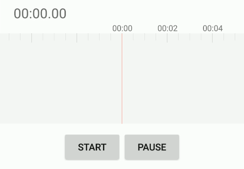

# TrackView

[  ](https://bintray.com/fingerart/maven/TrackView/_latestVersion)

An efficient android Audio display Library

## Preview



## How to use

Add to your module's `build.gradle` file.

```groovy
compile 'io.chengguo.android:track:1.2.1'
```

Add `TrackView` to your layout file.

```xml
<io.chengguo.track.TrackView
        android:id="@+id/track"
        android:layout_width="match_parent"
        android:layout_height="150dp" />
```

Support attribute.

| Attribute | remark |
| :------------ | :------------ |
| app:background_color | TrackView background |
| app:track_color | track color |
| app:cursor_color | center cursor color |
| app:graduation_s_color | small graduation color |
| app:graduation_l_color | large graduation color |
| app:graduation_text_color | graduation text color |
| app:graduation_text_size | graduation text size |

Call

```java
class Activity {
    TrackView track;

    void onCreate() {
        track = findViewById(R.id.track);

        //Set track adapter
        track.setTrackAdapter(new ITrackAdapter() {
                    @Override
                    public int getAmplitude() {
                        return 0;//TrackView callback every 50 milliseconds to get volume
                    }
                });
        
        //Set time change (rolling) listeners
        track.setGraduationListener(new ITimeChangeListener() {
                    @Override
                    public void onTimeChanged(int millisecond) {
                        //do something
                    }
                });
    }

    void onClickStart(View view) {
        track.start();
    }

    void onClickStop(View view) {
        track.stop();
    }

    void onDestroy() {
        track.stop();
    }
}
```

## How to Contribute

To contribute, please fork and create a pull request.

### Bug Fixes

If you find a bug, it would be awesome if you created an issue about it. Please include a clear description of the problem so that we can fix it!

## Pull Requests

I welcome and encourage all pull requests. It usually will take me within 24-48 hours to respond to any issue or request. Here are some basic rules to follow to ensure timely addition of your request:

1. Match coding style (braces, spacing, etc.) This is best achieved using CMD+Option+L (Reformat code) on Mac (not sure for Windows) with Android Studio defaults.
2. If its a feature, bugfix, or anything please only change code to what you specify.
3. Please keep PR titles easy to read and descriptive of changes, this will make them easier to merge :)
4. Pull requests must be made against develop branch. Any other branch (unless specified by the maintainers) will get rejected.

## Contact:

george@chengguo.io